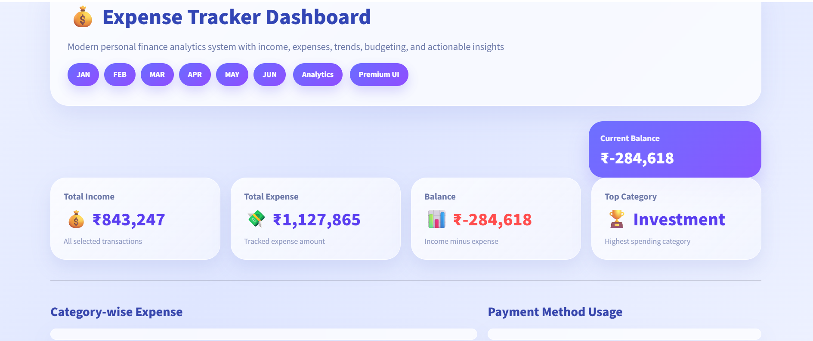
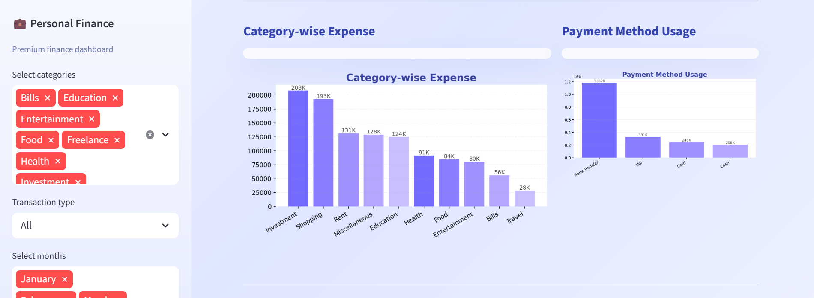
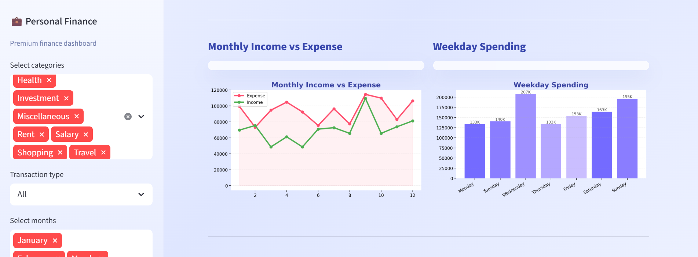
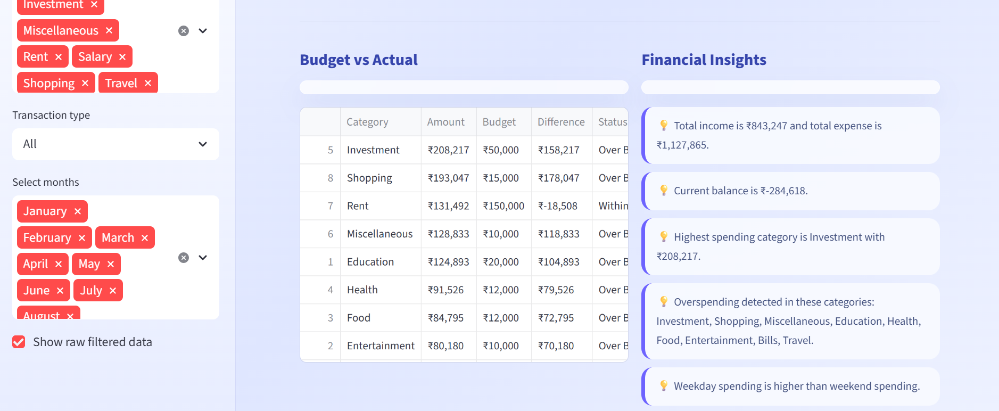
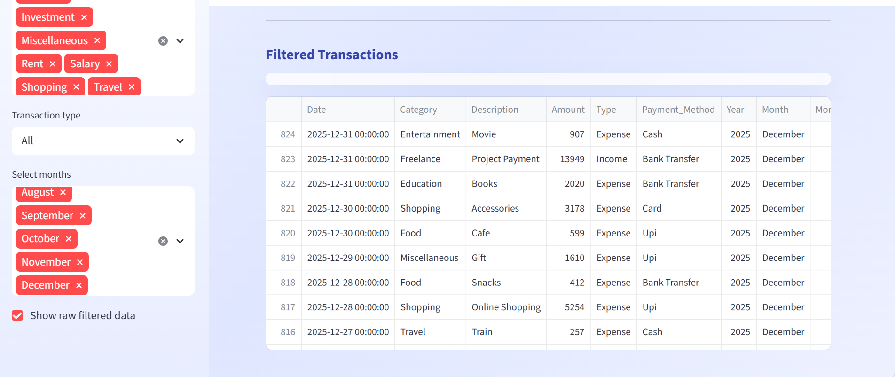

# 💰 Expense Tracker Dashboard

🚀 A modern personal finance analytics dashboard built using Python & Streamlit to track income, expenses, trends, budgeting, and actionable insights.

---

## 📌 Overview

Managing personal finances manually is difficult and error-prone. This project provides a **data-driven interactive dashboard** that helps users track, analyze, and optimize their financial behavior.

---

## ❗ Problem Statement

People often:

* Lose track of daily expenses
* Overspend without realizing
* Struggle with budgeting
* Lack visual understanding of financial patterns

---

## 💡 Solution

This dashboard solves the problem by:

* Providing **interactive visualizations**
* Showing **category-wise expense breakdown**
* Tracking **monthly income vs expense trends**
* Comparing **budget vs actual spending**
* Generating **automated financial insights**

---

## ✨ Features

* 📊 Category-wise expense analysis
* 💳 Payment method usage tracking
* 📈 Monthly income vs expense trends
* 📅 Weekday spending analysis
* 📉 Budget vs actual comparison
* 💡 Smart financial insights generation
* 📋 Filtered transaction table

---

## 🛠 Tech Stack

* Python 🐍
* Pandas 📊
* Matplotlib 📉
* Seaborn 🎨
* Streamlit 🌐

---

## 📂 Project Structure

Expense-Tracker-Dashboard/

├── data/
│   └── transactions.csv

├── images/
│   └── screenshots/
│       ├── dashboard_overview.png
│       ├── category_expense_analysis.png
│       ├── monthly_trends_analysis.png
│       ├── budget_vs_actual_insights.png
│       ├── filtered_transactions.png

├── app/
│   └── app.py

├── requirements.txt
└── README.md

---

## ▶️ How to Run

```bash
python -m venv venv
venv\Scripts\activate
pip install -r requirements.txt
streamlit run app/app.py
```

---

## 📊 Results & Insights

* 💰 Total Income: ₹843,247
* 💸 Total Expense: ₹1,127,865
* ⚠️ Current Balance: ₹-284,618

### 🔍 Key Insights:

* Expenses are higher than income
* Highest spending category: Investment
* Overspending detected across multiple categories
* Weekday spending is higher than weekend spending

---

## 📸 Screenshots

### 🖥 Dashboard Overview



### 📊 Category-wise Expense Analysis



### 📈 Monthly Income vs Expense



### 💰 Budget vs Actual + Insights



### 📋 Filtered Transactions



---

## 🧠 Proof Building Strategy

Day 1 → Setup

* Created project structure
* Setup environment
* Initial commit

Day 2 → Dataset

* Loaded dataset
* Cleaned & processed data
* Commit: "Added dataset & preprocessing"

Day 3 → Analysis

* Category-wise aggregation
* Monthly calculations
* Commit: "Added analysis logic"

Day 4 → Visualization

* Built charts (bar, line, etc.)
* Integrated into dashboard
* Commit: "Added visualizations"

Day 5 → Final Dashboard

* Added insights logic
* UI polishing
* Added screenshots + README
* Commit: "Final project upload"

---

## 🔮 Future Improvements

* 📱 Mobile application version
* ⚡ Real-time expense tracking
* 🤖 AI-based spending prediction
* 🔔 Budget alerts & notifications
* 🎯 Financial goal tracking

---

## 🚀 Author

Vaidehi ✨
